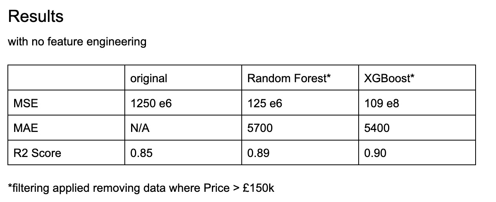

Experimentation for ML model to predict the value of a car sold on Autotrader, to be used by traders.

# Contents

- `etl.ipynb` contains the code development for the extract, transform, and load data pipeline.
- `ml.ipynb` contains data science experiments. Including preprocessing, feature engineering, model training, testing, and inference.

# Results

```
{
    "AM": "Aston Martin",
    "JAG": "Jaguar",
    "BMW": "BMW",
    "MB": "Mercedes-Benz",
    "LT": "Lotus",
    "AR": "Alfa Romeo",
    "LR": "Land Rover",
    "BTL": "Bentley",
    "PSC": "Porsche",
}
```

| Make | Model | MSE       | MAE   | R2     | Dataset Size |
| ---- | ----- | --------- | ----- | ------ | ------------ |
| AM   | xgb   | 1.098e+08 | 5431  | 0.9045 | 715          |
| JAG  | xgb   | 4.105e+06 | 1335  | 0.9570 | 1128         |
| BMW  | xgb   | 1.382e+06 | 785.0 | 0.9848 | 1097         |
| MB   | xgb   | 1.869e+06 | 921.5 | 0.9650 | 900          |
| LT   | xgb   | 8.313e+07 | 5315  | 0.8015 | 162          |
| AR   | xgb   | 3.420e+06 | 1226  | 0.8619 | 167          |
| LR   | xgb   | 4.403e+06 | 1273  | 0.9724 | 551          |
| BTL  | xgb   | 1.973e+08 | 7537  | 0.8501 | 768          |
| PSC  | xgb   | 2.675e+07 | 3303  | 0.8669 | 692          |



After my investigations and initial experiementation with

1. improving the pre-existing Random Forest model
2. experimenting with new model architectures

> **I reduced Error (MSE) by 91%.**
>
> **I increased the R<sup>2</sup> score significantly to 90%.**

---

**_Experimental Code Disclaimer_**

Important Note: This codebase is currently under active development and is considered experimental. It is not intended for production use. The code, including ML models and ETL processes, is being developed for the purpose of experimentation and research into predicting the value of cars sold on Autotrader, specifically aimed at traders. While I strive for accuracy, the results, performance metrics, and reliability of predictions should be critically assessed before any use case beyond experimentation.
